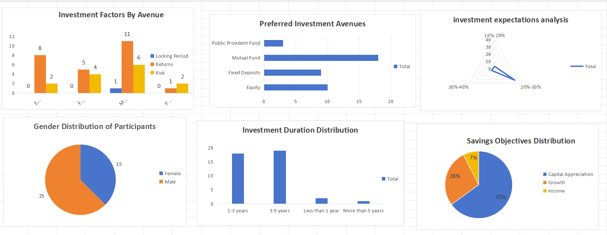
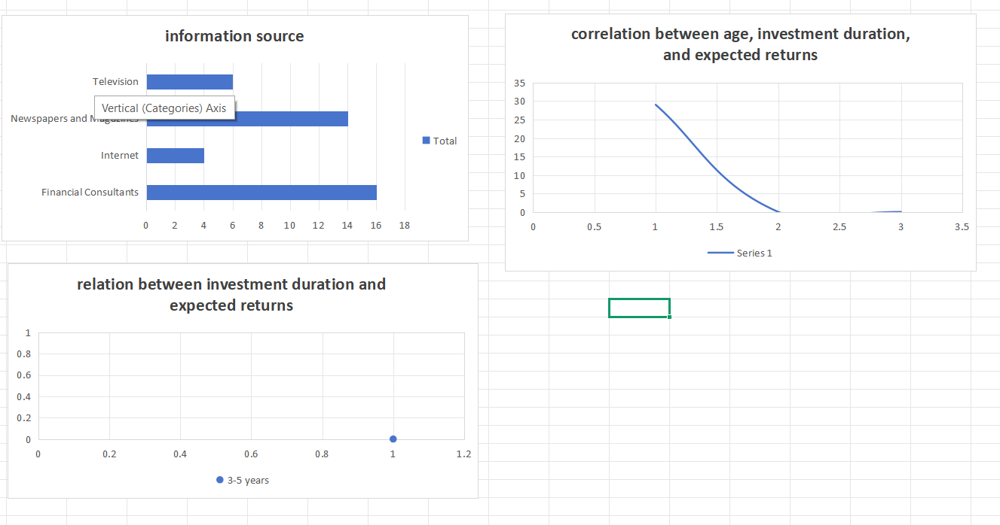

# Corporate Investment Preference Analysis & Executive Dashboard

An end-to-end data aggregation, demographic profiling, and visualization project completed during my Data Visualization Virtual Internship at **Cognifyz Technologies**. This project processes raw financial survey responses from 40 unique participants to isolate key trends behind how demographics, information channels, holding durations, and performance expectations influence capital placement across multiple asset classes.

---

## 📊 Core Data Metrics & Domain Insights

Based on the survey population ($N = 40$), the project surfaces clear, actionable financial indicators across five distinct operational pillars:

### 1. Demographic Distribution
*   **Gender Split:** The survey data comprises **25 Male** participants and **15 Female** participants, establishing an aggregated sample layout to evaluate behavioral variances between profiles.

### 2. Asset Allocation & Decision Drivers
*   **Investment Avenue Preferences:** **Mutual Funds** emerged as the dominant financial vehicle with **18 selections**, followed by **Equity (10)**, **Fixed Deposits (9)**, and **Public Provident Funds (3)**.
*   **Core Investment Factors:** When breaking down decision motivations, **Returns** served as the single primary driver (valued heavily by 25 out of 40 respondents), with **Risk assessment** being the second most critical criterion at 14 responses. 

### 3. Financial Motivations & Media Impact
*   **Savings Objectives:** Capital growth is the leading priority among investors, with **65% focusing purely on Capital Appreciation** and **28% prioritizing general Growth**, while only **7% seek direct Income**.
*   **Information Channels:** Investors lean most heavily on traditional advisory networks like **Financial Consultants (16)** and **Newspapers & Magazines (14)** to guide wealth allocation, significantly outperforming online search or television networks.

### 4. Holding Horizons & Yield Expectations
*   **Investment Duration:** The majority of individuals maintain mid-to-long term horizons, with **19 preferring 3–5 years** and **18 preferring 1–3 years**. Immediate horizons are minimal (**2 for less than 1 year** and **1 for more than 5 years**).
*   **Return Expectations:** Expected percentage yields are highly clustered, with **32 out of 40 investors expecting a 20%–30% return**, while 5 anticipate 30%–40%, and 3 expect a baseline of 10%–20%.

---

## 🛠️ Implementation & Technical Features

*   **Pivot Table Architecture:** Transformed raw row-level survey data rows into multidimensional summary tables to derive key insights (cross-tabulating asset classes against primary motivational factors).
*   **Advanced Visualizations:** Deployed specific chart formats tailored to variable dimensions—using **Pie Charts** for fractional objective distributions, **Radar/Spider Charts** for expectation bands, and **Stacked Column Bars** for multi-factor asset criteria analysis.
*   **Unified Dashboard Canvas:** Consolidated disparate task charts into a synchronized, clean user interface optimizing dashboard real estate.
*   **Interactive Controls (Slicers):** Integrated visual filter slicers equipped with cross-connected report channels, enabling a single click to dynamically filter metrics across the entire layout simultaneously.

---

## 🚀 Technical Stack Used

*   **Software Utility:** WPS Office Spreadsheet / Microsoft Excel
*   **Core Concepts:** Advanced Pivot Tables, Data Summarization, Visual Hierarchy Design, Report Connections, Cross-Tabulation, Interactive Slicers

---

## 📈 Dashboard Preview

### Executive Dashboard — Overview & Demographics

### Behavioral Analytics — Horizons & Expectations

---

## 📝 How to Explore the Project
1. Clone this repository to your local machine.
2. Open `level_3_tasks_dashboard.xlsx` using Microsoft Excel or WPS Office Spreadsheets.
3. Select the **dashboard** sheet tab and utilize the custom filter slicers to view real-time data adjustments.
4.
